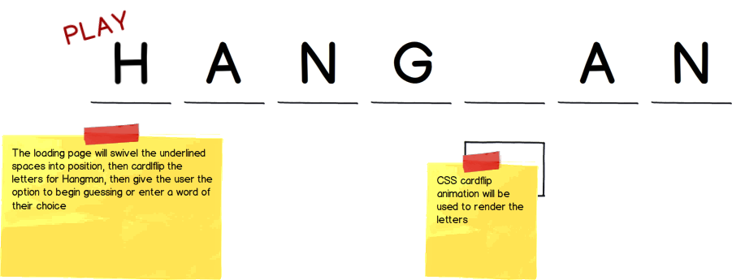

## Hangman - A browser based word game

### Background

Hangman is a Victorian era wordgame of very obscure origin. It is sometimes (and much more rarely) also known as Gallows.
In keeping with this theme, my rendition of Hangman will be in black and white. However, I intend to remove most of it's
ghastly trappings and focus on a clean, elegant, pleasant to use interface. It will be vaguely reminiscent of the command line,
but rendered near to full browser-width in a responsive format.

I will use CSS card flips, activated by Javascript, to reveal successful guesses. The CSS animation will handle the timed reveal of the card in manner pleasing to the viewer.

### MVP & Future Directions

This game of a Hangman will be a significant step up design-wise from any rendition of Hangman easily browsable on the internet.
In terms of Functionality, the core features will be:

- [ ] To guess a word chosen by the computer, who acts as judge, jury and executioner.
- [ ] To pose a word to the computer, and be amazed by its alacrity and accuracy in guessing.

In addition, should time allow after styling and animation is completed, I am interested in the following extensions to the game:
- [ ] Two player mode, which must be particularly mobile friendly, allowing one player to set a word and hand their device to their partner to guess
- [ ] Internationalization and user extensible dictionaries. This feature idea kind of fascinates me, I would love to allow for both a voting system to add words and wholescale upload of dictionaries with international language support. Both of these are potential bonus features or long term additions to the basic product.

Additionally, the game design and total production include:

- [ ] An About modal describing the background and rules of the game
- [ ] A production Readme

### Wireframes

The game itself will be a single immersive browser experience, mostly in black with an animated word interface at the center.
Input will come from the user keyboard. This will work by tying Javascript listeners to the entire window. Surplus features could include a modal for touch & cursor input game controls and voice recognition.
As a portfolio piece, it will also contain links to my Github and LinkedIn profiles and a domain specific email for recruiter inquiries, set to forward to my main address.

### Architecture and Technologies

I will execute this project with the following technologies:

- Vanilla JavaScript using direct DOM manipulation and event listeners
- Advanced CSS animation powered by Javascript for game rendering and a hopefully impressive loading screen.
- A game engine written in Vanilla Javascript, and a plain text initial dictionary.
- I intend to execute this game with one HTML5 semantic webpage, a single beautifully designed style sheet, and a consolidated handcrafted JavaScript file.
- Webpack will be used in the rapid development of this project, and it will also allow for the import of a 40,000 entry array of plain text words.
- The array of words is pre-formatted using one time Ruby script to change a text file into a JavaScript array.

### Implementation Timeline

**Day 1**: Write the entire Game Logic for the core set of features in JavaScript.

**Day 2**: Render the game in the browser, push it to GitPages, and write and user-test the interface.

**Day 3**: Animate the game board
- In particular, I will first focus on the animation for the loading screen. My intention is to impress the visitor on first page load, and keep their interest by satisfying that initial high impression of quality as they experiment with the game.
- If time allows, I will devote some attention to celebrations and laments for the player on their inevitable victories and defeats.

**Day 4**: Polish the game
- Link placement
- Modal instructions
- Potential use of ::after and possibly ::before CSS pseudo-selectors to provide timely guidance and commentary to the user

### Bonus features

- [ ] A plethora of potential bonus features were included above, but I will only begin work on these after I am fully satisfied with the core functionality and design of the game.

### Working Draft

[HangManGame.co](http://www.hangmangame.co)
